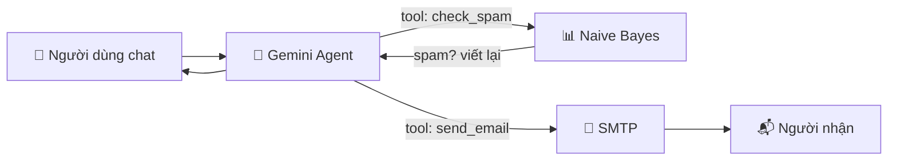

# 🛡️ Email Classifier — Phân loại thư rác tiếng Việt & Trợ lý Email AI


Ứng dụng web giúp **phát hiện tin nhắn / email rác (spam) tiếng Việt** và **trợ lý AI soạn & gửi email tự động** chỉ bằng một câu chat.

> 💬 *"Soạn mail mời họp dự án lúc 9h sáng thứ Hai gửi tới sep@congty.com"*
> → AI tự viết nội dung, kiểm tra xem thư có bị đánh dấu spam không, rồi gửi đi.

---

## ✨ Tính năng

### 1. 🔍 Phân loại Spam / Ham
| Engine | Đặc điểm |
|---|---|
| **Naive Bayes** (tự cài đặt từ đầu) | Chạy **offline**, không cần API key, nhanh. Độ chính xác **94.44%** trên tập test. Hiển thị **xác suất spam**. |
| **Gemini LLM** (qua LangChain) | Hiểu ngữ cảnh sâu hơn, phát hiện lừa đảo tinh vi. Cần Google API Key. |

- Nhập nội dung trực tiếp hoặc **tải file `.txt`, `.pdf`, `.docx`**
- Tự động retry khi Gemini báo lỗi giới hạn quota (429)

### 2. 🤖 Trợ lý Email AI (AI Agent)
- **Chat bằng tiếng Việt** để nhờ gợi ý tin nhắn hoặc soạn email
- Khi có yêu cầu gửi, Agent tự động:
  1. Soạn tiêu đề + nội dung lịch sự, đúng mục đích
  2. **Kiểm tra spam** bằng model Naive Bayes — nếu bị đánh giá là spam thì tự viết lại
  3. **Gửi email** qua SMTP (Gmail, Outlook, ...)
- Nhớ ngữ cảnh hội thoại: *"sửa lại ngắn hơn rồi gửi thêm cho b@congty.com"*
- Chế độ **"Xác nhận trước khi gửi"**: xem & chỉnh bản nháp rồi mới bấm Gửi
- An toàn: không tự bịa địa chỉ email, tối đa 10 người nhận/lần, chặn gửi trùng

---

## 🧠 Cách hoạt động



- **Naive Bayes**: Multinomial Naive Bayes với Laplace smoothing, tiền xử lý tiếng Việt (bỏ URL, số, ký tự đặc biệt) — viết thuần Python, không dùng thư viện ML có sẵn.
- **Agent**: vòng lặp *tool calling* của Gemini (LangChain `bind_tools`) với 2 tool `check_spam` và `send_email`.

---

## 📁 Cấu trúc thư mục

```
Email-Classifier/
├── app.py                  ← Giao diện Streamlit (entry point)
├── train.py                ← Huấn luyện Naive Bayes → models/model.pkl
├── config.py               ← Cấu hình tập trung (đọc từ .env)
├── requirements.txt
├── .env.example            ← Mẫu biến môi trường
│
├── core/
│   ├── naive_bayes.py      ← Thuật toán Naive Bayes (train / predict / xác suất)
│   ├── llm_classifier.py   ← Phân loại bằng Gemini + retry 429
│   └── email_agent.py      ← AI Agent soạn & gửi email
│
├── utils/
│   ├── data_loader.py      ← Đọc dataset CSV
│   ├── file_reader.py      ← Đọc .txt / .pdf / .docx
│   └── mailer.py           ← Gửi email qua SMTP
│
├── data/
│   ├── vi_dataset.csv      ← Dataset chính (~5.100 tin nhắn)
│   └── sms_spam_vi.csv     ← Dataset bổ sung
│
└── Ham/, Spam/             ← File mẫu để thử tính năng tải file
```

---

## 🚀 Cài đặt

### Yêu cầu
- **Python 3.12+** — kiểm tra bằng `python --version`
- Git
- *(Tuỳ chọn)* Google API Key cho Gemini — lấy miễn phí tại https://aistudio.google.com/app/apikey
- *(Tuỳ chọn)* Tài khoản Gmail để Agent gửi mail

### Bước 1 — Tải project

```bash
git clone https://github.com/BuiHoangViet/Email-Classifier.git
cd Email-Classifier
```

### Bước 2 — Tạo môi trường ảo & cài thư viện

**Windows (PowerShell)**
```powershell
python -m venv .venv
.venv\Scripts\Activate.ps1
pip install -r requirements.txt
```

**macOS / Linux**
```bash
python3 -m venv .venv
source .venv/bin/activate
pip install -r requirements.txt
```

> Nếu PowerShell báo lỗi *running scripts is disabled*, chạy một lần:
> `Set-ExecutionPolicy -Scope CurrentUser RemoteSigned`

### Bước 3 — Cấu hình file `.env`

```bash
# Windows
copy .env.example .env
# macOS / Linux
cp .env.example .env
```

Mở `.env` và điền:

```ini
# Gemini — cần cho engine LLM và Trợ lý Email AI
GOOGLE_API_KEY=AIza...

# SMTP — cần để Agent gửi được email
SMTP_HOST=smtp.gmail.com
SMTP_PORT=587
SMTP_USER=ban@gmail.com
SMTP_PASSWORD=xxxx xxxx xxxx xxxx
SMTP_SENDER_NAME=Tên của bạn
```

> 🔑 **Gmail bắt buộc dùng App Password**, không dùng mật khẩu đăng nhập:
> bật *Xác minh 2 bước* → tạo tại https://myaccount.google.com/apppasswords
>
> ⚠️ Không commit file `.env` lên Git (đã có sẵn trong `.gitignore`).

### Bước 4 — Huấn luyện model Naive Bayes

```bash
python train.py
```

Kết quả:
```
[INFO] Tổng mẫu   : 4733  (sau lọc từ 5120)
[INFO] Train / Test: 3313 / 1420
[INFO] Accuracy    : 94.44%
[INFO] ✔ Model lưu : models/model.pkl
```

> Dùng dataset khác: `python train.py --dataset data/sms_spam_vi.csv`
> (Có thể bỏ qua bước này — app có nút **"Huấn luyện ngay"** khi chưa có model.)

### Bước 5 — Chạy ứng dụng

```bash
streamlit run app.py
```

Trình duyệt tự mở tại **http://localhost:8501** 🎉

---

## 🖥️ Hướng dẫn sử dụng

### Phân loại spam
1. Sidebar → **Chức năng**: *🔍 Phân loại spam*
2. Chọn engine: *Naive Bayes* hoặc *Gemini LLM*
3. Dán nội dung (tab **Nhập tay**) hoặc tải file (tab **Tải file**)
4. Bấm **🔍 Phân loại** → kết quả 🚨 **SPAM** hoặc ✅ **HAM** kèm xác suất

### Trợ lý Email AI
1. Sidebar → **Chức năng**: *🤖 Trợ lý Email AI*
2. Nhắn yêu cầu vào ô chat, ví dụ:

| Bạn nhắn | AI làm gì |
|---|---|
| `Soạn mail xin nghỉ phép ngày mai gửi tới sep@congty.com` | Soạn → kiểm tra spam → **gửi luôn** |
| `Gợi ý tin nhắn xin lỗi khách vì giao hàng trễ` | Chỉ đưa bản nháp, **không gửi** |
| `Viết lại trang trọng hơn rồi gửi cho cả hr@congty.com` | Sửa bản trước và gửi |
| `Gửi mail cảm ơn cho anh Nam` | Hỏi lại địa chỉ email (không tự đoán) |

3. Mỗi email hiển thị thành một thẻ: người nhận, tiêu đề, nội dung, kết quả kiểm tra spam, trạng thái ✅ Đã gửi / ❌ Lỗi
4. Muốn duyệt trước khi gửi → bật **"Xác nhận trước khi gửi"** ở sidebar

---

## ⚙️ Tuỳ chỉnh

Các thông số nằm trong `config.py` (giá trị bí mật đặt trong `.env`):

| Biến | Mặc định | Mô tả |
|---|---|---|
| `GEMINI_MODEL` | `gemini-2.5-flash` | Model Gemini (đổi được qua `.env`) |
| `DATASET_PATH` | `data/vi_dataset.csv` | Dataset dùng để train |
| `TEST_SIZE` | `0.3` | Tỷ lệ tập test |
| `MAX_WORDS` / `MIN_WORDS` | `200` / `3` | Cắt câu dài / bỏ câu quá ngắn khi train |
| `AGENT_MAX_STEPS` | `8` | Số bước gọi tool tối đa của Agent |
| `MAX_RECIPIENTS` | `10` | Số người nhận tối đa mỗi email |

---

## 🐛 Lỗi thường gặp

| Lỗi | Cách sửa |
|---|---|
| `ModuleNotFoundError` | Kích hoạt venv rồi chạy `pip install -r requirements.txt` |
| `SyntaxError` ở `naive_bayes.py` | Cần Python **3.12+** |
| `Chưa tìm thấy models/model.pkl` | Chạy `python train.py` hoặc bấm *Huấn luyện ngay* |
| `Lỗi 429 / quota` | Chờ ~1 phút, hoặc dùng engine Naive Bayes |
| `API key not valid` | Kiểm tra `GOOGLE_API_KEY` trong `.env` |
| `Đăng nhập SMTP thất bại` | Gmail phải dùng **App Password**, kiểm tra `SMTP_USER` / `SMTP_PASSWORD` |
| Sửa `.env` nhưng không có tác dụng | Tắt app (Ctrl+C) và chạy lại `streamlit run app.py` |

---

## 🛠️ Công nghệ

- **Python 3.12**, **Streamlit** — giao diện web
- **LangChain** + **Google Gemini** — LLM & AI Agent (tool calling)
- **Naive Bayes** tự cài đặt — phân loại offline
- **scikit-learn** (chia train/test), **pandas** (đọc dữ liệu)
- **smtplib** — gửi email; **python-dotenv** — quản lý cấu hình
